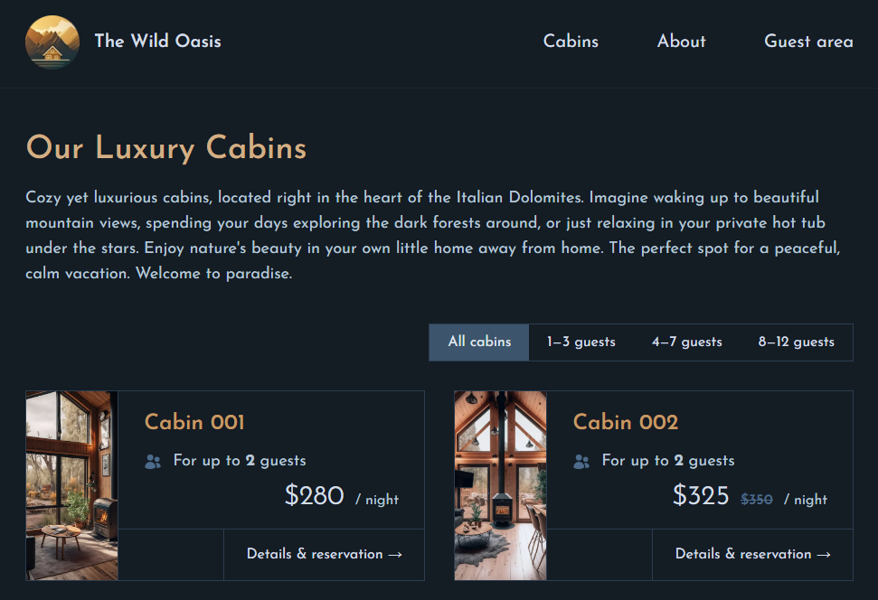

## 👋 Introduction

A modern hotel website allowing guests to book luxurious cabins effortlessly. Built with Next.js and React’s client and server components, it leverages modern techniques to deliver an exceptional user experience through an intuitive interface.



## 🌟 Features

- **Login** : Google OAuth for secure user authentication
- **Profile** : Guests can update their profiles, including their national ID number and home country.
- **Cabins** : Guests can check detailed information about the cabins, availability and make reservations online.
- **Reservations** : Guests can view all past and upcoming reservations, with the option to edit or cancel future bookings.

## 👨‍💻 Technologies

- **React** : JavaScript library for UI development.
- **Next.js** : React framework for building fast and scalable web applications.
- **Supabase** : Cloud database service for real-time and secure data storage.
- **date-fns** : JavaScript date utility library for parsing, formatting, and manipulating dates.
- **Tailwind CSS** : Utility-first CSS framework that enables fast and responsive UI development.
- **heroicons/react** : Collection of beautifully crafted SVG icons designed for React applications.
- **react-day-picker** : A flexible and customizable date picker component for React

## 🎗️ Instalation Steps

First, run the development server:

```bash
npm run dev
# or
yarn dev
# or
pnpm dev
# or
bun dev
```

Open [http://localhost:3000](http://localhost:3000) with your browser to see the result.

You can start editing the page by modifying `app/page.js`. The page auto-updates as you edit the file.

This project uses [`next/font`](https://nextjs.org/docs/basic-features/font-optimization) to automatically optimize and load Inter, a custom Google Font.

## 📖 Learn More

To learn more about Next.js, take a look at the following resources:

- [Next.js Documentation](https://nextjs.org/docs) - learn about Next.js features and API.
- [Learn Next.js](https://nextjs.org/learn) - an interactive Next.js tutorial.

You can check out [the Next.js GitHub repository](https://github.com/vercel/next.js/) - your feedback and contributions are welcome!

## ⚙️ Deploy on Vercel

The easiest way to deploy your Next.js app is to use the [Vercel Platform](https://vercel.com/new?utm_medium=default-template&filter=next.js&utm_source=create-next-app&utm_campaign=create-next-app-readme) from the creators of Next.js.

Check out our [Next.js deployment documentation](https://nextjs.org/docs/deployment) for more details.

## 💰 Support me by Donating

[](https://buymeacoffee.com/pfiterman)
